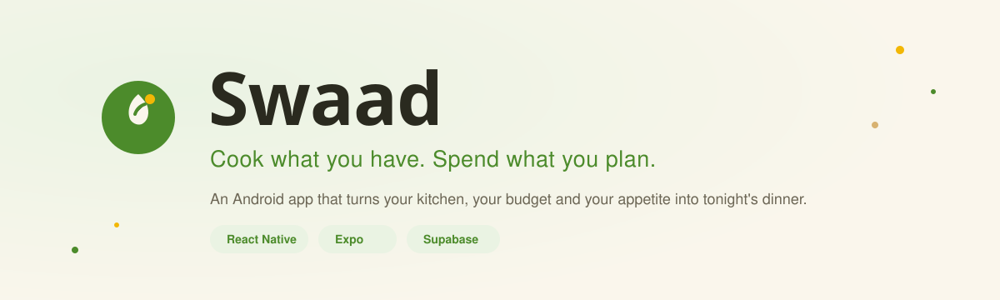

  

<h1 align="center">Swaad</h1>

  An Android app that turns your kitchen, your budget and tonight's appetite into a shortlist of Indian dishes you can actually cook.

---

## What Swaad does

Most people cooking at home don't start from a recipe. They start from what's already in the fridge, how much they're willing to spend on the rest, and what they feel like eating. Swaad works the same way: tell it what ingredients and appliances you have, set a budget for anything extra, pick a meal type and any dietary restrictions, and it returns 2 to 3 dishes ranked by how well they fit.

Every result comes with a match score against your ingredients, an itemized shopping list for whatever's missing, and a price estimate checked against your stated budget. Nothing gets suggested that breaks a dietary rule or contains something on your allergy list, even as a "you're close" option.

This started from a specific gap: recipe apps built for a Western pantry don't know what a tadka pan or a pressure cooker is, don't reason in rupees, and don't handle Jain or eggetarian restrictions as first-class filters. Swaad is built around Indian regional cooking and Indian kitchen economics from the ground up.

## How it works

You start by picking ingredients and appliances from a list (staples come pre-checked), or typing in anything that isn't there. Next is a rupee budget for whatever you'd still need to buy, kept separate from what's already in your kitchen. Then a meal type: breakfast, lunch, dinner, a snack window, something fancy, something light, or kid-friendly. Then diet: vegetarian, non-vegetarian, eggetarian, vegan or Jain, plus a free-text box for allergies that gets checked against a synonym list, so typing "nuts" correctly rules out peanut, cashew, almond and walnut too.

What comes back is 2 to 3 recipes, ranked on ingredient match, budget fit, and how well they suit the meal type you picked. If nothing qualifies, you get a plain message telling you to loosen the budget or add an ingredient, not a blank screen.

From there you can save a dish, read the full method, check its shopping list, or leave a review for other cooks.

## Screens

The landing screen is dish discovery: a few dishes shown up front to give a sense of what the app can find. From there it's the four-step input flow (kitchen, budget, meal type, diet), then results, which shows ranked dish cards with a match ring. Recipe detail has the ingredients, what's missing, the shopping list, the method, and reviews. Saved holds whatever you've bookmarked, tied to your account. Shopping list rolls up every ingredient your saved dishes need, grouped by aisle and priced. Profile has your account, default diet, city tier for regional pricing, and a light, dark, or system appearance toggle.

## Under the hood

The matching, budget and allergy logic lives in plain TypeScript with no React or network code in it, which is why it's unit tested directly rather than through the UI.

`lib/matching.ts` hard-excludes on diet, allergies, missing appliances, meal type and budget, then scores whatever survives on ingredient match (60%), budget fit (25%) and meal-type fit (15%). `lib/budget.ts` builds a priced shopping list for whatever's missing and classifies the total as under, near, or over what you set. `lib/allergyMatch.ts` tokenizes the free-text allergy field and resolves it against an ingredient-slug synonym table.

## Built with

React Native and Expo for the app, TypeScript in strict mode throughout, Supabase for the recipe database, auth and row-level security, React Navigation for the tab and stack structure, and Jest for the logic modules.

